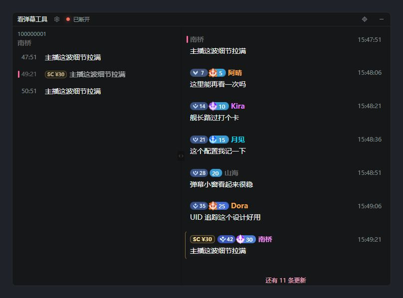
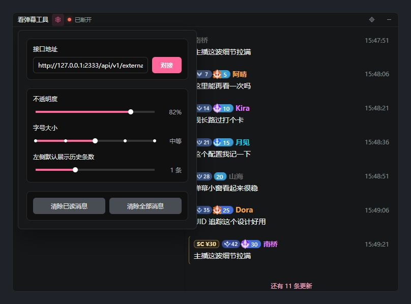

# 小小鱼弹幕 · DanmuTools（看弹幕工具）

一个面向哔哩哔哩直播的桌面弹幕阅读工具。**右侧按顺序读弹幕，左侧回看同一位观众的发言**，在持续刷新的消息中保留阅读位置。

支持 Windows（视窗系统）10 及以上的 64 位系统，提供半透明置顶窗口、已读管理、主播头像与昵称展示。

[下载发布版本](https://github.com/Nixsw/Bili-Danmu-Look/releases) · [开始使用](#开始使用) · [操作说明](#操作说明) · [源码开发](#源码开发) · [反馈问题](https://github.com/Nixsw/Bili-Danmu-Look/issues)



*配图来自当前源码的浏览器预览，使用内置演示弹幕，未连接真实直播间。*

## 能做什么

- **按顺序阅读**：标记最早未读后，下一条未读会平滑移到首行；随时可定位回未读位置。
- **按观众回看**：点击右侧任意消息，左侧立即展示该观众的记录，并标出所选消息。
- **保留阅读位置**：新消息进入缓存，不会把正在浏览历史的视口强制拉到底部；未显示的新消息以数量提示。
- **贴合桌面使用**：窗口置顶、可拖动和缩放，两栏宽度可调，不透明度与字号可调。
- **展示直播身份**：对接成功后显示主播昵称、圆形头像及可用的头像挂件，系统标题和托盘提示同步更新。
- **保留熟悉的消息标识**：支持普通弹幕、醒目留言、荣耀等级、粉丝团等级和大航海标识。

## 开始使用

### 1. 下载并运行

前往[发布页](https://github.com/Nixsw/Bili-Danmu-Look/releases)，在所需版本的附件中选择：

| 文件 | 使用方式 |
| --- | --- |
| `*_x64-setup.exe` | 常规安装包，运行后按提示安装 |
| `*_x64_zh-CN.msi` | 系统安装包，可交给系统安装程序处理 |
| `*_x64_portable.zip` | 便携压缩包，解压后运行 `danmu-tools.exe` |

运行需要 WebView2 Runtime（微软网页视图运行时）。**直接使用发布包无需安装开发工具链。**

当前源码版本为 **1.5.0**，可下载的版本与附件以发布页为准。

### 2. 对接弹幕服务

1. 打开程序，点击标题栏的齿轮按钮。
2. 在“接口地址”中填入配套服务提供的 HTTP/HTTPS（网页请求协议）连接接口地址。
3. 点击“对接”。程序会保存地址并立即发起连接，之后启动时自动使用已保存的地址。
4. 连接成功后查看标题栏的连接状态；接口提供主播信息时，昵称和头像也会随之显示。

这里填写的是**获取弹幕连接参数的接口地址**，不是直播间号、直播间网页地址或弹幕长连接地址。需要先准备可用的配套接口服务。

## 操作说明

| 操作 | 效果 |
| --- | --- |
| 点击右侧任意消息 | 在左侧查看该观众的发言记录，并定位到所选消息 |
| 点击右侧最早未读消息 | 标记已读，并将下一条最早未读移到首行 |
| 点击右侧较新的消息 | 只切换左侧观众记录，不会跳过前面的未读消息 |
| 点击左侧消息 | 自由逐条标记已读，不受右侧的阅读顺序限制 |
| 在任一列表滚动鼠标滚轮 | 查看历史或后续消息 |
| 点击标题栏“定位未读消息” | 回到全局最早未读；没有未读时跳到最新一屏 |
| 拖动中间竖向分隔条 | 调整左右两栏的宽度比例 |
| 拖动标题栏或消息列表空白处 | 移动桌面窗口 |
| 拖动窗口边缘 | 调整窗口大小 |

右侧消息的右键菜单支持复制弹幕、复制昵称、复制用户标识和“全部已读此人”；左侧支持复制弹幕和“全部已读”。

左侧始终围绕选中的观众与消息显示记录。新消息不会自动移动当前视口，鼠标移出也不会触发补滚动；列表下方的“还有 N 条更新”提示尚未显示的后续消息。

窗口隐藏后，可通过系统托盘的“显示/隐藏”恢复，也可从托盘打开设置或退出程序。

## 显示设置



| 设置 | 可选范围 | 默认值 |
| --- | --- | --- |
| 不透明度 | 10%–100% | 82% |
| 字号大小 | 较小 / 推荐 / 中等 / 较大 / 特大 | 中等 |
| 左侧默认展示历史条数 | 0–3 条 | 1 条 |

“左侧默认展示历史条数”控制选择一条消息时，尽量在它上方保留多少条同一观众的历史发言。

设置面板还提供“清除已读消息”和“清除全部消息”。不透明度作用于窗口背景及相关边线，消息文字保持清晰；分隔控件在悬停或拖动时会点亮。

接口地址和显示设置会保存。两栏比例目前仅保留在本次运行期间。

## 常见问题

**为什么点击右侧消息没有变成已读？**

右侧只允许顺序标记全局最早未读，防止跳过尚未阅读的消息。点击其他消息仍会切换左侧观众记录；需要自由标记时，可使用左侧列表或右键菜单。

**为什么新弹幕没有自动滚到眼前？**

程序会保留当前阅读位置。可向下滚动查看更新，或使用标题栏的“定位未读消息”回到待阅读位置。

**对接失败后需要反复点击吗？**

不需要。程序会自动重试，失败后的等待时间依次为 3、5、10 秒，之后保持 10 秒。若持续失败，请检查配套服务是否可用、接口地址和授权信息是否有效。

**便携版会把设置保存在程序旁边吗？**

不会。便携版省去了安装步骤，配置仍保存在当前用户的系统应用数据目录中，同一用户运行的程序实例会使用该目录：

```text
%APPDATA%\DanmuTools\DanmuTools\config\config.json
```

## 源码开发

前端使用 React（界面库）和 TypeScript（类型化脚本语言），桌面壳使用 Tauri 2（桌面应用框架），后端使用 Rust（系统编程语言）。真实弹幕连接、协议解析、消息缓存和配置持久化由后端负责。

### 开发环境

- Windows（视窗系统）10 及以上的 64 位系统。
- Node.js（脚本运行环境）及 npm（依赖管理工具）；发布构建使用 22 版运行环境。
- Rust/Cargo（后端编译与依赖工具链）稳定版。
- Visual Studio Build Tools（微软构建工具）中的 C++（原生编译语言）工具链。
- WebView2 Runtime（微软网页视图运行时）。

安装锁定依赖并启动桌面开发：

```powershell
npm ci
npm run tauri:dev
```

### 浏览器预览与模拟消息

在两个终端分别运行：

```powershell
# 终端一：模拟弹幕服务
npm run mock:ws

# 终端二：浏览器预览
npm run dev
```

浏览器预览内置演示消息，并连接 `ws://127.0.0.1:17878` 的模拟服务。它不执行真实平台协议，也不具备桌面置顶、系统托盘或系统拖窗能力。

### 检查与打包

| 命令 | 用途 |
| --- | --- |
| `npm test` | 前端测试 |
| `npm run build` | 前端类型检查与生产构建 |
| `cargo test --manifest-path src-tauri\Cargo.toml` | 后端测试 |
| `npm run tauri:build` | 桌面程序与安装包构建 |
| `npm run package:portable` | 将已构建的正式程序打包为便携压缩包 |

1.5.0 的本地构建产物：

```text
src-tauri/target/release/danmu-tools.exe
src-tauri/target/release/bundle/nsis/DanmuTools_1.5.0_x64-setup.exe
src-tauri/target/release/bundle/msi/DanmuTools_1.5.0_x64_zh-CN.msi
src-tauri/target/release/bundle/portable/DanmuTools_1.5.0_x64_portable.zip
```

### 标准消息格式

以下 JSON（结构化数据）用于内部消息处理和模拟服务，**不是连接接口的返回格式**。真实平台的二进制消息由桌面后端解析为统一结构。

```json
{
  "content": "这条弹幕可以在左侧回看",
  "uid": "100000001",
  "nickname": "观众昵称",
  "userLevel": 12,
  "fanLevel": 8,
  "guardType": 0,
  "messageType": "danmu",
  "timestampMs": 1700000000000
}
```

- `uid`（用户标识）建议传字符串，避免大整数精度丢失。
- `content`（正文）：普通弹幕为 1–40 个字符，醒目留言为 1–120 个字符。
- `userLevel`（荣耀等级）范围为 0–100，`fanLevel`（粉丝团等级）范围为 0–120。
- `guardType`（大航海类型）：0 为无、1 为总督、2 为提督、3 为舰长。
- `timestampMs`（毫秒时间戳）优先；仅传 `timestamp`（秒时间戳）时会按秒归一化。
- 醒目留言使用 `messageType: "superChat"`（醒目留言类型），可附带 `superChat`（醒目留言信息）中的 `price`（价格）、`durationSec`（持续秒数）、`startTimeMs`（开始毫秒时间）和 `endTimeMs`（结束毫秒时间）。

### 代码导航

| 路径 | 内容 |
| --- | --- |
| `src/App.tsx` | 主界面、设置与消息交互 |
| `src/core/` | 前端消息类型与浏览器备用消息存储 |
| `src/ui/` | 显示格式、徽章、窗口布局与视口工具 |
| `src-tauri/src/` | 桌面后端、连接协议、消息存储、配置与托盘 |
| `scripts/mock-ws.ts` | 模拟弹幕服务 |
| `docs/` | 展示配图、外观调研及验证资料 |

开发约定见 [AGENTS.md（项目协作说明）](AGENTS.md)。
